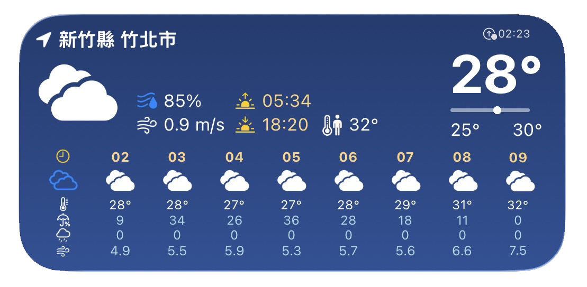

# Scriptable Weather Widget

一款為 iPhone 中型小工具設計的 Scriptable 天氣元件，使用目前位置顯示即時天氣、當日高低溫與逐時預報。

## Demo

<!-- 將展示圖片命名為 demo.png，放在專案根目錄。 -->
<!--  -->


## 功能特色

- 自動取得目前位置與縣市名稱
- 顯示目前溫度、體感溫度、濕度與風速
- 顯示日出、日落及當日最高／最低溫
- 顯示逐時天氣、降雨機率、雨量與風速預報
- 支援日間與夜間天氣圖示
- 網路暫時異常時可使用最近一次成功取得的快取
- 可切換預報間隔與背景樣式

> 此專案的版面僅支援「中型」小工具。使用其他尺寸時，畫面會顯示尺寸提示。

## 使用技術

- JavaScript 與 [Scriptable](https://scriptable.app/) 小工具 API
- OpenWeather One Call API 4.0 天氣資料
- Apple Location 定位與反向地理編碼
- SF Symbols 天氣與資訊圖示
- Scriptable FileManager 與 JSON 本機快取

## 使用前準備

- iPhone 或 iPad
- [Scriptable](https://scriptable.app/)
- OpenWeather API Key，並完成 One Call API 4.0 訂閱
- 允許 Scriptable 使用定位與網路

## OpenWeather One Call API 4.0

本專案使用的是 **One Call API 4.0**，不是早期的 One Call API 2.5。One Call API 2.5 已於 2024 年 6 月被官方棄用；4.0 採獨立的按量計費訂閱，必須先完成訂閱與付款資料設定才能使用。

依 OpenWeather 官方目前的方案：

- 每日前 1,000 次 API 呼叫免費
- 超過每日免費額度後，會依實際呼叫次數收費
- 完成訂閱後，每日呼叫上限預設為 2,000 次
- 若不希望產生費用，可登入 OpenWeather 帳戶，在 **Billing plans** 將 One Call API 4.0 的每日上限改為 **1,000 次**

本小工具每次完整更新會呼叫 3 次 OpenWeather API，分別取得目前天氣、逐時預報與當日高低溫。Scriptable 約每 30 分鐘提出一次更新要求，但實際更新時間由 iOS 決定；手動執行、多台裝置或多個小工具也會增加使用量。

訂閱前請查看官方最新資訊：

- [One Call API 4.0 文件](https://openweathermap.org/api/one-call-4)
- [OpenWeather 價格方案](https://openweathermap.org/price)
- [OpenWeather FAQ](https://openweathermap.org/faq)
- [One Call API 2.5 停止服務說明](https://openweathermap.org/one-call-1-deprecated)

## 安裝教學

### 1. 加入腳本

下載本專案的以下兩個檔案，並加入 Scriptable：

- `WeatherWidget.js`
- `WeatherSecrets.js`

請保留原始檔名，因為主程式會從 `WeatherSecrets` 模組讀取 API Key。

### 2. 設定 API Key

開啟 `WeatherSecrets.js`，將 `YOUR_API_KEY_HERE` 替換成自己的 OpenWeather API Key：

```javascript
// API Key 獨立存放，避免直接寫在主程式中。
module.exports = {
  API_KEY: "YOUR_API_KEY_HERE"
}
```

請勿將含有真實 API Key 的檔案提交到公開版本庫。

### 3. 測試腳本

在 Scriptable 中執行一次 `WeatherWidget.js`，並在系統詢問時允許定位權限。若 API Key、One Call API 4.0 訂閱與網路連線正常，應會顯示天氣預覽。

### 4. 加入主畫面

1. 長按 iPhone 主畫面並新增 Scriptable 小工具。
2. 選擇「中型」尺寸。
3. 長按已加入的小工具，選擇「編輯小工具」。
4. 將 Script 設定為 `WeatherWidget`。

## 基本設定

可在 `WeatherWidget.js` 開頭的設定區調整：

| 設定 | 用途 |
| --- | --- |
| `LANG` | 天氣資料語系 |
| `FORECAST_INTERVAL_HOURS` | 每 1 或 2 小時顯示一筆預報 |
| `USE_BACKGROUND_GRADIENT` | 切換漸層或純色背景 |

目前介面以公制單位設計，建議將 `UNITS` 保持為 `"metric"`。

## 常見問題

### 無法取得天氣

請確認裝置已連線網路、Scriptable 具有定位權限、API Key 已正確設定，並已完成 One Call API 4.0 訂閱。若出現 `429`，請檢查當日呼叫次數是否已達帳戶設定上限。

### 小工具顯示尺寸錯誤

本專案只支援中型小工具。請移除原有小工具後，以中型尺寸重新加入。

### 修改後仍顯示舊資料

程式可能正在顯示最近一次成功取得的快取。請先在 Scriptable 中直接執行腳本，確認最新資料能正常載入。

## 隱私與安全

定位資訊只用於取得所在地名稱與天氣資料；天氣快取會保存在 Scriptable 的本機文件目錄。建議始終將 API Key 存放於 `WeatherSecrets.js`，不要直接寫入主程式。

## License

授權條款請參閱 [LICENSE](./LICENSE)。
